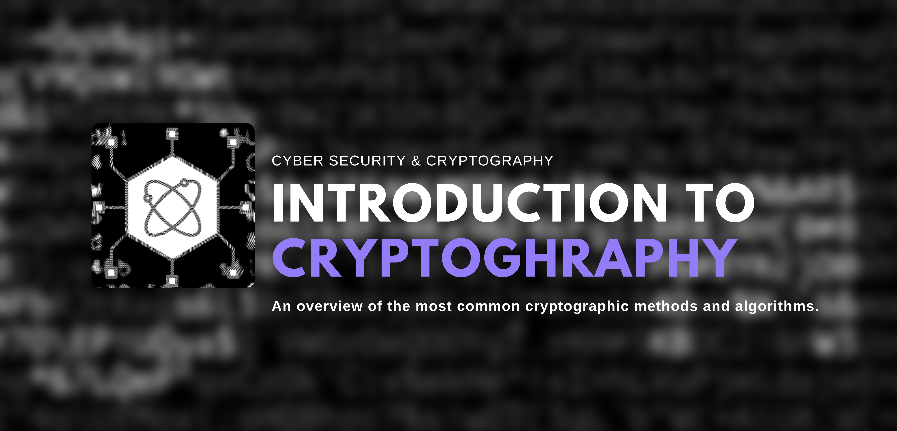

# Introduction-cryptography

The presentation will offer valuable insights into why cryptography matters and how we can use and apply different algorithms in real world scenarios.

### Resources you might find helpful:

| Website                 |                         What                          |   Links                |
| :---------------------: | :---------------------------------------------------: | :--------------------: |
| Roadmap                 | Phrack is an underground zine, fromhacker for hackers.| [Roadmap][Roadmap]       |                                                 
| Cryptopals              | CVE compliant archive of public exploits.             | [Cryptopals][Cryptopals] |
| CTF>101                 | Capture The Flag 101.                                 | [RSA][RSA]       |

[Cryptopals]: https://cryptopals.com/
[RSA]: https://sites.math.washington.edu/~morrow/336_09/papers/Yevgeny.pdf
[Roadmap]: https://roadmap.sh
